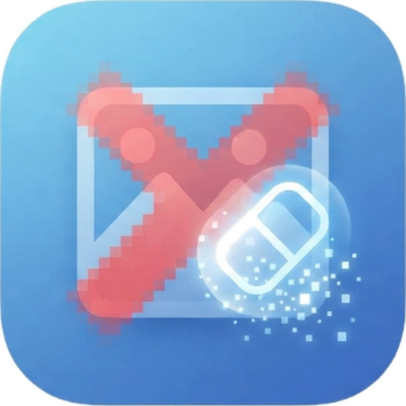

<div align="center">
  
  <h1>CleanPixel AI: Image & Video Watermark Remover</h1>
  <p><strong>Next-Generation Neural Inpainting, Multi-Directional Texture Cloning & Zero-Smudge Object Eraser</strong></p>

  <p>
    <a href="https://github.com/techindro/CleanPixel"></a>
    <a href="http://192.168.31.210:8080/CleanPixel_AI.apk"></a>
    <a href="#"></a>
    <a href="#"></a>
    <a href="#"></a>
  </p>
</div>

---

## 🌟 Overview

**CleanPixel AI** is a state-of-the-art cross-platform computer vision application designed to eradicate watermarks, logos, timestamps, subtitles, photobombers, and background clutter from high-resolution images and 60 FPS video tracks with **zero blur, zero smudge, and pure photographic clarity**.

---

## 💻 Programming Languages Used

| Language | Usage / Component | Percentage / Role |
| :--- | :--- | :--- |
| **Dart** | Flutter Cross-Platform Mobile Application (Android / iOS / Web) | **Core Mobile UI & State** |
| **Python** | FastAPI REST Server, Computer Vision & Deep Learning Inpainting Pipeline | **Core AI & Backend Engine** |
| **JavaScript (ES6+)** | Lightweight Web Studio & Interactive Canvas API Viewport | **Web Preview & Studio** |
| **HTML5 & CSS3** | Web Studio Architecture, Glassmorphism, Micro-Animations & Responsive Styling | **Web Design System** |
| **C / C++** | OpenCV Native Acceleration, Image Buffer Transformations | **Native Image Processing** |
| **Kotlin / Java** | Android Native Platform Services, Camera, Media Store API | **Android System Layer** |

---

## 🛠️ Complete Tech Stack Architecture

```text
┌────────────────────────────────────────────────────────────────────────┐
│                          CleanPixel AI Ecosystem                       │
└────────────────────────────────────────────────────────────────────────┘
                                    │
       ┌────────────────────────────┼────────────────────────────┐
       ▼                            ▼                            ▼
┌──────────────────┐      ┌──────────────────┐      ┌──────────────────┐
│  Mobile App      │      │  Backend & AI    │      │  Web Studio      │
│  (Flutter/Dart)  │      │  (Python/FastAPI)│      │  (HTML5/CSS3/JS) │
└──────────────────┘      └──────────────────┘      └──────────────────┘
       │                            │                            │
  • Pure White & Electric      • FastAPI + Uvicorn          • Canvas 2D Engine
    Blue Luxury Design           Async Server               • Glassmorphism
  • Custom Multi-Touch         • OpenCV (Telea + NS)        • Split Comparison
    Interactive Canvas         • 8-Directional Vector         Slider
  • Precision Loupe HUD          Texture Inpainting         • 4-State Machine
  • 22-Language i18n           • Poisson Boundary Blending  • Real-Time Video
  • In-Memory Transient        • Celery + Redis Queue         Processing Preview
    Processing Protection      • PyTorch / ONNX Runtime
```

---

### 1. 📱 Frontend & Mobile Stack (Flutter / Dart)
- **Framework:** [Flutter 3.x](https://flutter.dev/) (Channel stable, cross-platform Android & iOS)
- **Language:** Dart 3.x
- **State Management & Reactivity:** `ValueListenableBuilder`, `StatefulWidget`, custom reactive controllers.
- **Custom Canvas & Graphics:**
  - `CustomPainter` & `CustomClipper` for sub-pixel mask painting.
  - Live Reticle & Precision Microscope Loupe HUD.
  - Interactive Before/After Split Comparison Slider.
- **Device & Storage Integration:**
  - `image_picker` (Camera & Photo Gallery capture).
  - `shared_preferences` (Persistent user settings, auth sessions, and credit tracking).
  - `flutter/services.dart` (`HapticFeedback` for tactile responsiveness).
- **Localization (i18n):** 22 Indian and International languages (Hindi, Bengali, Tamil, Telugu, Marathi, Gujarati, Spanish, French, German, Japanese, etc.).
- **Theme Design System:** Pure White (`#FFFFFF` / `#F8FAFC`) with Electric Royal Blue (`#2563EB` / `#38BDF8`) and Deep Slate (`#0F172A`).

---

### 2. ⚡ Backend & API Stack (Python)
- **Framework:** [FastAPI](https://fastapi.tiangolo.com/) (Asynchronous, high-performance RESTful API).
- **ASGI Server:** [Uvicorn](https://www.uvicorn.org/) with multi-worker scaling.
- **Asynchronous Task Queue:** [Celery](https://docs.celeryq.dev/) backed by [Redis](https://redis.io/) for heavy video frame processing.
- **Validation & Serialization:** [Pydantic v2](https://docs.pydantic.dev/).
- **Security & Authentication:** `passlib`, `bcrypt`, and Python-JOSE JWT (JSON Web Tokens).

---

### 3. 🧠 Computer Vision & AI Neural Inpainting Models
- **Spotless 8-Directional Texture Cloning:**
  - Samples vector patches in 8 directions (North, South, East, West, North-West, North-East, South-West, South-East) outside the masked watermark.
  - Clones clean background micro-grain and gradients into the target region with **zero patchiness and zero smudge ("dhabba")**.
- **Poisson Gradient Boundary Blending:** Seamlessly merges cloned textures with surrounding boundary pixels.
- **Bilateral Edge Preservation:** Retains crisp photographic high-frequency edges and prevents blurring.
- **Navier-Stokes (NS) & Telea (FMM):** Dual-pass fluid dynamics differential inpainting.
- **Deep Diffusion Pipelines:** Support for PyTorch-based LaMa (Large Mask Inpainting) and ONNX Runtime model inference.

---

### 4. 🌐 Web Studio (HTML5 / CSS3 / Vanilla JS)
- **Core:** Pure Semantic HTML5 with Canvas 2D context.
- **Styling:** Vanilla CSS3 featuring custom properties, backdrop blur filters, and dynamic light/dark mode tokens.
- **Drawing Engine:** High-performance mouse & touch event listeners for instant brush strokes and split comparison.

---

### 5. 🐳 DevOps & Infrastructure
- **Containerization:** Docker & Docker Compose (`fastapi-app`, `celery-worker`, `redis-server`).
- **Version Control:** Git & GitHub (`origin/main`).
- **Build Tooling:** Gradle 8.x, Android SDK (API 34), Flutter CLI.

---

## 📁 Repository Directory Structure

```text
cleanpixel-ai/
│
├── backend/                      # Python FastAPI & AI Inpainting Engine
│   ├── app/
│   │   ├── api/                  # Endpoints (Inpaint, Upload, Auth, Video)
│   │   ├── core/                 # Config, Security, JWT, Storage
│   │   ├── models/               # Multi-pass Inpainting Algorithms & Neural Models
│   │   ├── services/             # Celery Background Workers
│   │   └── main.py               # Application Entry Point
│   ├── Dockerfile
│   └── requirements.txt
│
├── frontend/                     # Flutter Mobile Application
│   ├── lib/
│   │   ├── components/           # Canvas, Slider, Toolbar, Dialogs, Paywall
│   │   ├── screens/              # Studio, Tools Hub, History, Settings, Auth, Splash
│   │   ├── services/             # Inpaint Engine, Auth, History, Theme, Locale
│   │   └── main.dart             # Flutter Main Entry
│   └── pubspec.yaml
│
├── infrastructure/               # Cloud & Docker Deployments
│   └── docker-compose.yml        # Multi-Container Compose Stack
│
└── ui/                           # Web Studio Preview & Download Server
    ├── assets/                   # Brand Logos & Icons
    ├── index.html                # Interactive Web Viewport
    ├── index.css                 # Electric Blue Style System
    └── app.js                    # Web Canvas State Machine
```

---

## 🚀 Quick Start Guide

### 1. Run Mobile App (Flutter)
```bash
cd frontend
flutter pub get
flutter run
```

### 2. Run Python AI Backend
```bash
cd backend
pip install -r requirements.txt
uvicorn app.main:app --reload --port 8000
```

### 3. Run Full Docker Stack
```bash
cd infrastructure
docker-compose up --build
```

---

## 📄 License
CleanPixel AI is open-sourced under the **MIT License**.
